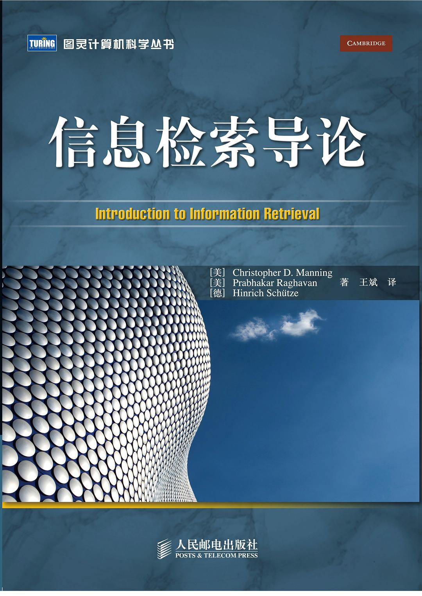
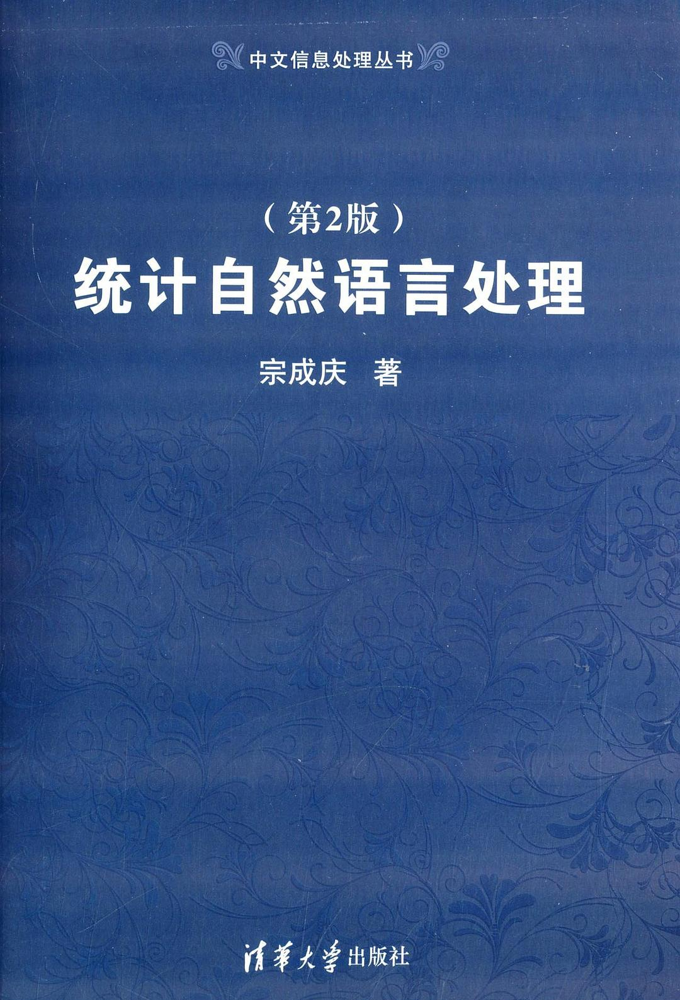
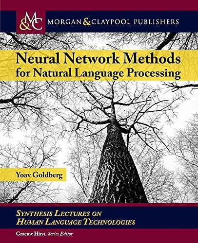
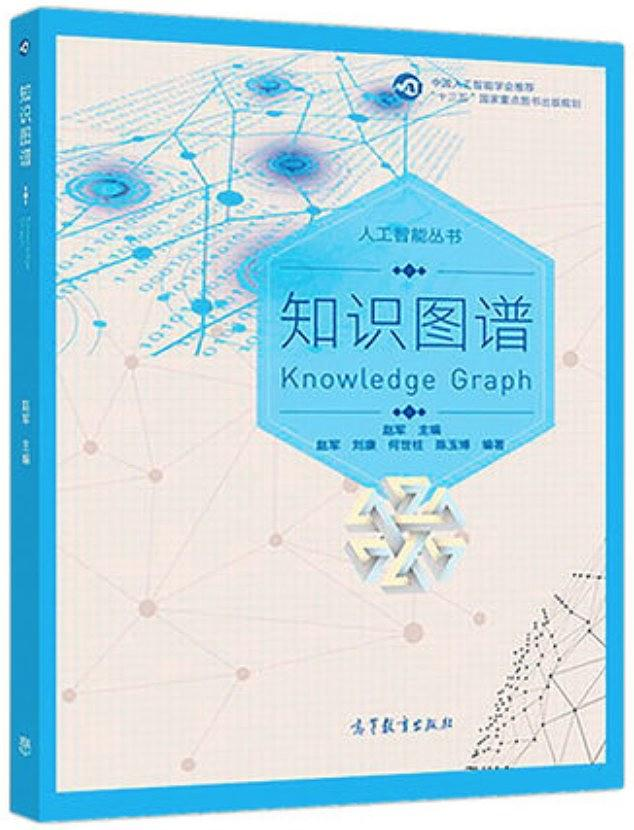
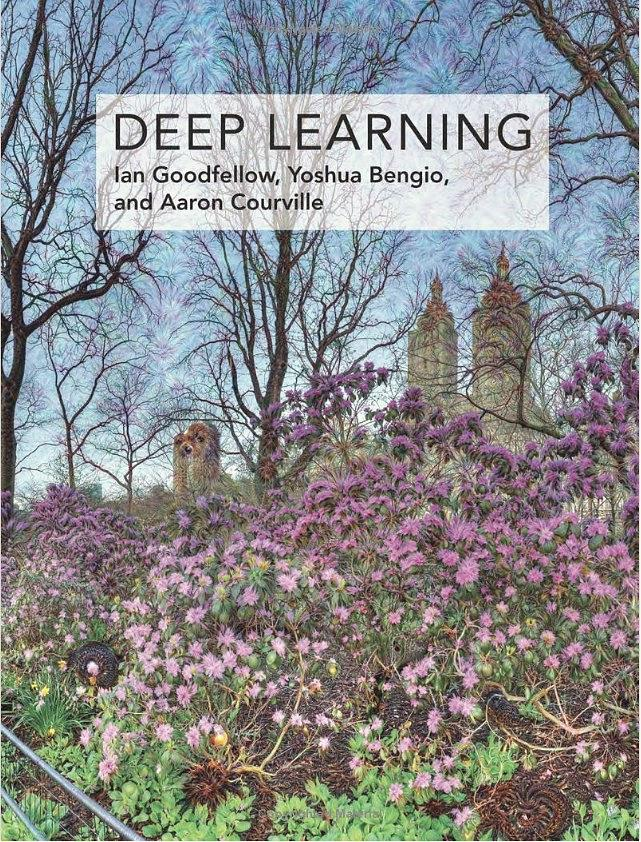
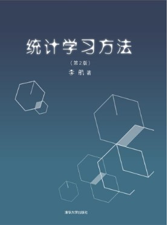
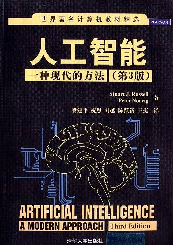
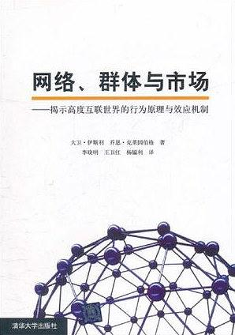

# 自然语言处理相关推荐书目

## 自然语言处理

### 信息检索导论

* 原作名：Introduction to Information Retrieval

* 作者：Christopher D.Manning / Hinrich Schutze / Prabhakar Raghavan

* 出版社：人民邮电出版社；出版年：2010年；页数：388

* 必读：第2、6章

* 选读：第11、12、13、14、15、16、17、18、21章

### 统计自然语言处理（第2版）

* 作者：宗成庆
* 出版社：清华大学出版社；出版年：2013年；页数：570

### Neural Network Methods for Natural Language Processing

* 作者：Yoav Goldberg
* 出版社：Synthesis Lectures on Human Language Technologies (Morgan & Claypool Publishers)；出版年：2017；页数：310

## 知识图谱

### 知识图谱

* 作者：赵军
* 出版社：高等教育出版社；出版年: 2018；页数: 312

## 机器学习

### 机器学习

* 作者：周志华
* 出版社：清华大学出版社；出版年：2016年；页数：425

### Deep Learning

* 作者：Ian Goodfellow / Yoshua Bengio / Aaron Courville
* 出版社：MIT Press；出版年：2016年；页数：800

### 神经网络与深度学习

* 作者：邱锡鹏
* 出版社：机械工业出版社；出版年：2019；页数
* 网站：<https://nndl.github.io/>

### 统计学习方法（第二版）

- 作者：李航
- 出版社：清华大学出版社；出版年：2019；页数：464

## 人工智能

### 人工智能：一种现代的方法

* 原作名：Artificial Intelligence: A Modern Approach
* 作者： Stuart J.Russell / Peter Norvig
* 出版社：清华大学出版社；出版年：2013年；页数：918

## 社会计算

### 网络、群体与市场：揭示高度互联世界的行为原理与效应机制

* 原作名：Networks, Crowds, and Markets
* 作者：David Esley / Jon Kleinberg
* 出版社：清华大学出版社；出版年：2011年；页数：511
* 必读：第一部分、第四部分
* 选读：第五部分、第六部分

