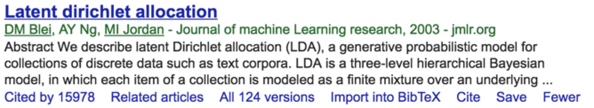
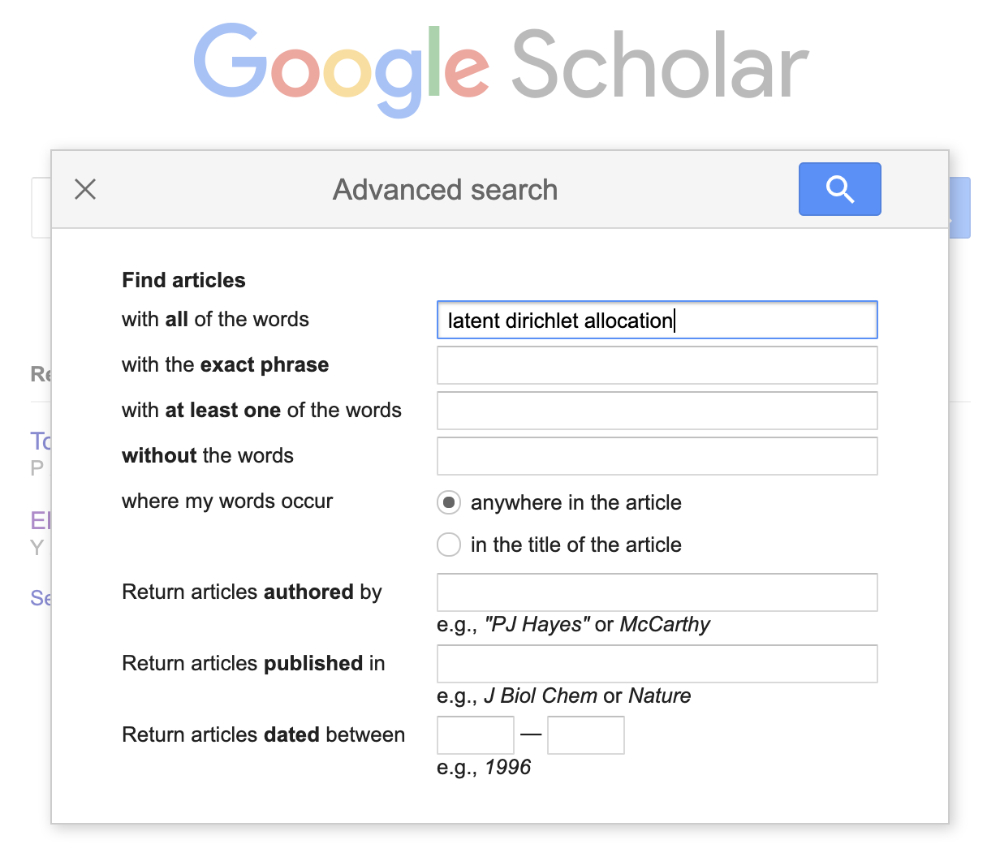
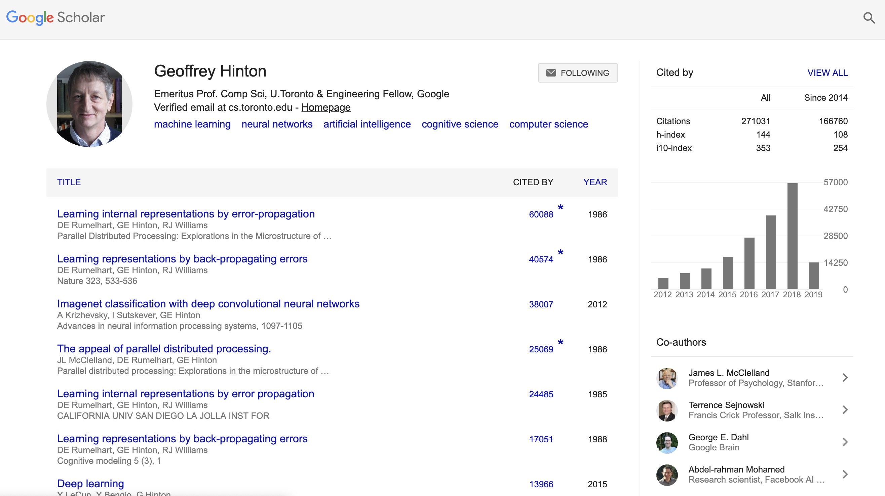

# 如何通过文献掌握学术动态

要成为自然语言处理某个领域合格研究者的基本要求就是，掌握坚实的基础知识和了解全面的学术动态。基础知识，如高等数学、概率论、人工智能、机器学习、语言学等，这一般是在大学本科或研究生期间通过选修相关课程和教材自学来完成；现在大规模在线教育（MOOC）风靡全球，国内外著名高校的课程资料在线唾手可得，是自学成才的重要资源，然而从统计来看，能够坚持完成在线课程的同学比例并不高，可见学习氛围也是很重要的成才因素。这里，主要面向在校学生(包括本科生或研究生)，介绍如何阅读学术文献、了解学术动态，努力站到巨人的肩膀上，为创新研究做好准备。

阅读学术文献是掌握学术动态的主要方式。计算机技术日新月异，科技文献也汗牛充栋，如何查阅和选择领域重要文献，是需要在实践中不断磨练的技巧；即使精心选择，NLP每个课题也都至少有几十篇论文需要读，实际没有必要平均用力，可以泛读和精读相结合，快速掌握课题的学术脉络。接下来，分别介绍在这些方面的一些建议。

## 如何选择文献

研究者应该具备"T"型知识体系，一方面要有对NLP和机器学习学术动态有全面及时的了解，主要是保持知识更新，为创新思想做好知识储备；另一方面要对从事的研究课题已有代表工作有地毯式的掌握。面向这两种不同的目标，有不同的选择文献的技巧。

### 面向特定主题的文献选择

有时候，导师突然找到你，说xx课题很有前景，让你调研一下看有没有研究的价值；有时候，你参加学术会议或听学术报告，突然听到xx课题，觉得很有意思；或者某门课程或某项实习工作给你安排了一个课题，需要你尽快调研相关工作，了解来龙去脉。这时候你会发现，搜索引擎是面向特定主题查阅文献的重要工具，尤其是谷歌提供的Google Scholar，由于其庞大的索引量，是我们披荆斩棘的利器。Google Scholar不仅可以查阅学者学术信息、被引用情况，还提供引用格式文件。

Google Scholar还提供高级检索功能，我比较常见的功能包括：

- 按作者搜索：author:"DM Blei"，可以搜索指定作者的相关论文；
- 按发表期刊/会议搜索：source:"Nature"，可以搜索发表在指定期刊/会议的相关论文；
- 按标题出现关键词搜索：allintitle:"latent dirichlet allocation"，可以搜索在标题出现某些关键词的论文；
- 搜索引擎常用的and、or和""均支持，其中""表示按引号中的字符串完整搜索。

特别是按标题出现关键词的搜索功能，对于确定某个研究思想是否已经有发表工作，非常有效。例如，假设你在从事自动问答课题研究，某天想到是否可以将Transformer技术用于该任务，那你最好先用Google Scholar搜一下 allintitle:"question answering" and "transformer" 来确认是否已经有其他研究者发表了类似想法的成果。千万不要等到做完实验开始写论文了，才想起做这个确认工作，会非常被动。

为了了解某个课题，如果能找到一篇该领域的最新研究综述，就省劲多了。最方便的方法，是首先在维基百科等权威在线百科全书中查询该主题的科普综述介绍。在此基础上，可以在中文知网（CNKI）中搜索"课题名称+综述"或在Google Scholar中搜索“课题名称 + survey / review / tutorial / 综述”来查找。也有一些出版社专门出版各领域的综述文章，例如NOW Publisher出版的Foundations and Trends系列，Morgan & Claypool Publisher出版的Synthesis Lectures on Human Language Technologies系列等。它们发表了很多热门方向的综述，如文档摘要、情感分析和意见挖掘、学习排序、语言模型等。

一般而言，热门的研究方向总会有比较及时的综述论文。如果方向太新，还没有相关综述，一般还可以查找该方向发表的最新论文，阅读它们的“相关工作”章节，顺着列出的参考文献，就基本能够了解相关研究脉络了。当然，还有很多其他办法，例如去各大学术会议或暑期学校上找Tutorial报告，或者直接咨询该领域的研究者，都是比较有效的办法。

### 面向知识更新的文献选择

在除了面向特定主题的文献查阅外，研究生(特别是博士生）需要锻炼的重要能力，就是常年坚持对最新学术动态及时全面的了解。为了实现这一点，需要同学建立全面且及时更新的信息源，我理解一般有以下几个方面：

- arXiv.org 上定期发布的论文；
- 相关国际顶级会议每年发表的论文集；
- 相关国际顶级期刊定期发表的论文；
- 国际顶尖高校研究组或企业研究机构发布的新闻或学术报告；
- 科技媒体和社交媒体集中报道或讨论的学术成果；等等。

一般而言，研究生可以通过订阅相关RSS Feed或者邮件列表来保持更新。另外值得一提的信息来源是，Google Scholar支持学者建立个人学术主页，不仅可以查阅最新的发表论文列表，还有最全的引用计数。而在访问著名学者的Google Scholar学术主页时，同学可以通过右上角的Following来关注该学者的最新发表论文情况。例如，下面就是著名学者Geoffrey Hinton的学术主页：<https://scholar.google.com/citations?user=JicYPdAAAAAJ>

一般，为了建立对NLP全面的了解，我们监测的信息来源提供的论文每年以数千计。近年来由于深度学习技术火爆异常，arXiv.org几个频道下每隔几天就有几十篇论文发布。面对如此众多的论文，很难通读，如果学会遴选论文和快速泛读，找出最值得关注的重要论文，是提高效率的重要手段。一般可由以下几个信号大致判断一篇工作是否值得关注：

- 论文的作者是否为该领域的著名学者，研究机构是否来自业内顶尖。
- 论文是否发表在顶级期刊/会议上。
- 论文社会关注度如何，是否获得最佳论文，引用情况如何。

当然，以上也都只是模糊信号，并不能一概而论，论文好坏还要由成果自己来判定。只是说，以上这些信号可以帮助同学加快筛选和判断。此外，论文题目等方面也会提供丰富的判定信号。例如我的经验之一是，论文题目越短其创新价值更高的概率会更大，越值得关注，等等，不一而足，还需要同学在实践中不断总结和精进。

## 如何阅读文献

阅读论文也不必需要每篇都从头到尾看完。一篇学术论文通常包括以下结构，我们用序号来标记建议的阅读顺序：
- 题目（1）
- 摘要（2）
- 正文：导论（3）、相关工作（6）、本文工作（5）、实验结果（4）、结论（7）
- 参考文献（6）
- 附录

按照这个顺序，基本在读完题目和摘要后，大致可以判断这篇论文与自己研究课题的相关性，然后就可以决定是否要精读导论和实验结果判断学术价值，是否阅读本文工作了解方法细节。此外，如果希望了解相关工作和未来工作，则可以有针对性地阅读“相关工作”和“结论”等部分。

## 善用社交媒体和科技媒体

这几年社会媒体的发展，越来越多学者转战微博和知乎，有浓厚的交流氛围。如何找到这些学者呢？一个简单的方法就是在微博或知乎中的用户搜索中检索“自然语言处理”、“计算语言学”、“信息检索”、“机器学习”等字样，马上就能跟过去只在论文中看到名字的老师同学们近距离交流了。值得一提的是，很多在国外任教的老师和求学的同学也活跃在微博和知乎上，经常发布重要的业内新闻，值得关注。学术研究既需要苦练内功，也需要与人交流。所谓言者无意、听者有心，也许其他人的一句话就能点醒你苦思良久的问题。毫无疑问，微博和知乎等社交媒体提供了很好的交流平台，但也要注意不宜沉迷。

由于AI火爆异常，国内也兴起了以机器之心、雷锋网/AI科技评论、PaperWeekly、DeepTech、新智元为代表的技术媒体。这些媒体非常关注英文世界的最新技术动态，经常能够几乎同步发布相关中文新闻，值得关注。当然，求快就难免经常出现翻译错误，而且为了吸引阅读也会经常使用“重磅”等吸睛的字眼，不过从积极意义来看，与2010年前中英文世界相对隔离的状况相比，这些媒体的出现和兴起无疑有着非常积极的意义。总体来看，这些科技媒体是很好的把握和了解科技动态的入口，但到底媒体介绍的这些技术突破是否货真价实，还需要更深入地阅读相关文献和实验验证才能确认。