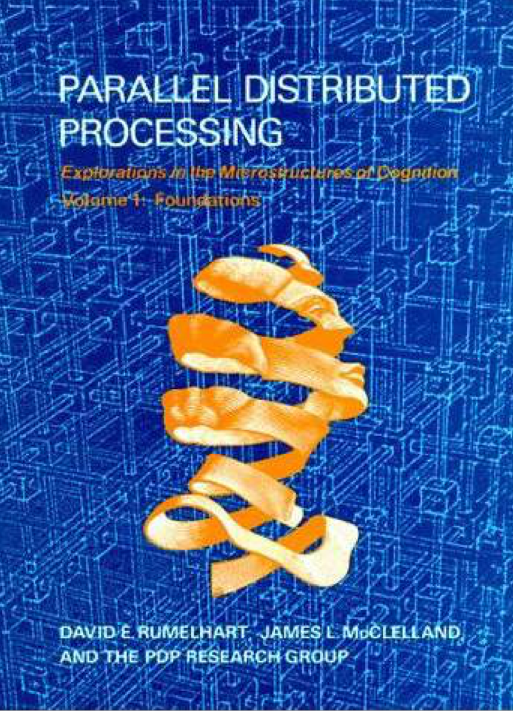
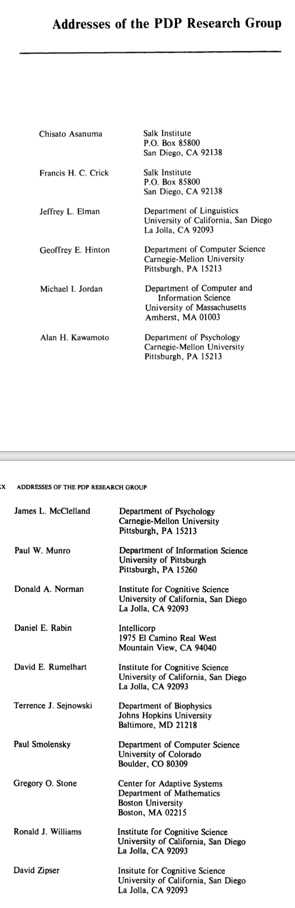
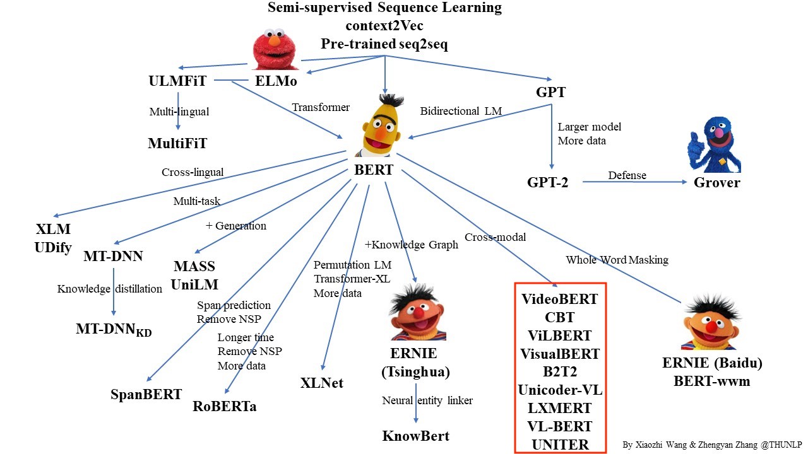
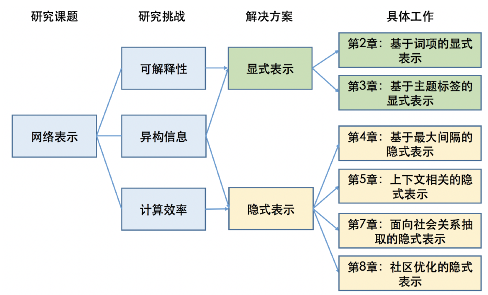

# 好的研究想法从哪里来

王家卫的电影《一代宗师》中有段经典的比武桥段，宫会长对叶问说“今天我们不比武术，比想法”。其实，好的点子或者想法（idea），也是一篇优秀研究成果的灵魂。而计算机领域流行着一句话“IDEA is cheap, show me the code”，也说明对于重视实践的计算机学科而言，想法的好坏还取决于它的实际效能。这里就来谈下好的研究想法从哪里来。

## 什么算是好的想法

2015年，我在微博上写过一个调侃的小段子：

> ML派坐落美利坚合众山中，百年来武学奇才辈出，隐然成江湖第一大名门正派，门内有三套入门武功，曰：图模型加圈，神经网加层，优化目标加正则。有童谣为证：熟练ML入门功，不会作文也会诌。

到了2018年，我又续了一小段：

> 不期数年，北方DL神教异军突起，内修表示学习，外练神经网络，心法众多，曰门，曰注意，曰记忆，曰对抗，曰增强。经ImageNet一役威震武林，豢Alpha犬一匹无人可近。一时家家筑丹炉，人人炼丹忙，门徒云集，依附者众，有一统江湖之势。有童谣为证：左手大数据，右手英伟达，每逢顶会炼丹忙。

这里面提到的图模型加圈、神经网络加层、优化目标加正则，神经网络中的门、注意、记忆等，都是一些改进模型性能的创新思路，被各大NLP任务广泛使用并发表论文，也许就是因为被不同NLP任务的重复使用和发表，多少有些审美疲劳而缺少更深的创新思想，被有些网友和学者诟为“灌水”，似乎都不算好的想法。

那么什么才是好的想法呢？我理解这个”好“字，至少有两个层面的意义。

### 学科发展角度的”好“

学术研究本质是对未知领域的探索，是对开放问题的答案的追寻。所以从推动学科发展的角度，评判什么是好的研究想法的标准，首先就在一个“**新**”字。

过去有个说法，人工智能学科有个魔咒，凡是人工智能被解决（或者有解决方案）的部分，就不再被认为代表“人类智能”。计算机视觉、自然语言处理、机器学习、机器人之所以还被列为人工智能主要方向，也许正是因为它们尚未被解决，尚能代表“人类智能”的尊严。而我们要开展创新研究，就是要提出新的想法解决这些问题。这其中的”新“字，可以体现在提出新的问题和任务，探索新的解决思路，提出新的算法技术，实现新的工具系统等。

在保证”新“的基础上，研究想法好不好，那就看它**对推动学科发展的助力有多大**。深度学习之所以拥有如此显赫的影响力，就在于它对于人工智能自然语言处理、语音识别、计算机视觉等各重要方向都产生了革命性的影响，彻底改变了对无结构信号（语音、图像、文本）的语义表示的技术路线。

### 研究实践角度的”好“

那是不是想法只要够”新“就好呢？是不是越新越好呢？我认为应该还不是。因为，只有**能做得出来的想法**才有资格被分析好不好。所以，从研究实践角度，还需要考虑研究想法的**可实现性**和**可验证性。**

可实现性，体现在该想法是否有足够的数学或机器学习工具支持实现。可验证性，体现在该想法是否有合适的数据集合和广泛接受的评价标准。很多民间科学家的想法之所以得不到学术界的认同，就是因为这些想法往往缺乏可实现性和可验证性，只停留在天马行空的纸面，只是些虚无缥缈的理念。

## 好的研究想法从哪里来

想法好还是不好，并不是非黑即白的二分问题，而是像光谱一样呈连续分布，因时而异，因人而宜。计算机科技领域的发展既有积累的过程，也有跃迁的奇点，积累量变才会产生质变，吃第三个馒头饱了，也是因为前面两个馒头打底。

现在的学术研究已经成为高度专业化的职业，有庞大的研究者群体。”Publish or Perish“，是从事学术职业（如教授、研究员、研究生）的人必须做好平衡的事情，不能要求研究者的每份工作都是“诺贝尔奖”或“图灵奖”级的才值得发表。只要对研究领域的发展有所助力，就值得发表出来，帮助同行前进。鲁迅说：天才并不是自生自长在深林荒野里的怪物，是由可以使天才生长的民众产生，长育出来的，所以没有这种民众，就没有天才。这个庞大研究者群体正是天才成长的群众基础。同时，学术新人也是在开展创新研究训练中，不断磨砺寻找好想法能力，鲁迅也说：即使天才，在生下来的时候的第一声啼哭，也和平常的儿童的一样，决不会就是一首好诗。

那么，好的研究想法从哪里来呢？我总结，首先要有区分研究想法好与不好的能力，这需要**深入全面了解所在研究方向的历史与现状**，具体就是对学科文献的全面掌握。人是最善于学习的动物，完全可以将既有文献中不同时期研究工作的想法作为学习对象，通过了解它们提出后对学科发展的影响——具体体现在论文引用、学术评价情况等各方面——建立对研究想法好与不好的评价模型。我们很难条分缕析完美地列出区分好与不好想法的所有特征向量，但人脑强大的学习能力，只要给予足够的输入数据，就可以在神经网络中自动学习建立判别的模型，鉴古知今，见微知著，这也许就是常说的学术洞察力。

做过一些研究的同学会有感受，仅阅读自己研究方向的文献，新想法还是不会特别多。这是因为，读到的都是该研究问题已经完成时的想法，它们本身无法启发新的想法。如何产生新的想法呢？我总结有三种可行的基本途径：

**实践法**。即在研究任务上实现已有最好的算法，通过分析实验结果，例如发现这些算法计算复杂度特别高、训练收敛特别慢，或者发现该算法的错误样例呈现明显的规律，都可以启发你改进已有算法的思路。现在很多自然语言处理任务的Leaderboard上的最新算法，就是通过分析错误样例来有针对性改进算法的 [1]。

**类比法**。即将研究问题与其他任务建立类比联系，调研其他相似任务上最新的有效思想、算法或工具，通过合理的转换迁移，运用到当前的研究问题上来。例如，当初注意力机制在神经网络机器翻译中大获成功，当时主要是在词级别建立注意力，后来我们课题组的林衍凯和沈世奇提出建立句子级别的注意力解决关系抽取的远程监督训练数据的标注噪音问题 [2]，这就是一种类比的做法。

**组合法**。即将新的研究问题分解为若干已被较好解决的子问题，通过有机地组合这些子问题上的最好做法，建立对新的研究问题的解决方案。例如，我们提出的融合知识图谱的预训练语言模型，就是将BERT和TransE等已有算法融合起来建立的新模型 [3]。

正如武侠中的最高境界是无招胜有招，好的研究想法并不拘泥于以上的路径，很多时候是在研究者对研究问题深刻认知的基础上，综合丰富的研究阅历和聪明才智产生”顿悟“的结果。这对初学者而言恐怕还很难一窥门径，需要从基本功做起，经过大量科研实践训练后，才能有登堂入室之感。

在科研实践过程中，除了通过大量文献阅读了解历史，通过深入思考总结产生洞察力外，还有一项必不可少的工作，那就是主动开放的学术交流和合作意识。不同研究领域思想和成果交流碰撞，既为创新思想提供了新的来源，也为”类比“和”顿悟“提供了机会。了解一下历史就可以知晓，人工智能的提出，就是数学、计算机科学、控制论、信息论、脑科学等学科交叉融合的产物。而当红的深度学习的起源，1980年代的Parallel Distributed Processing （PDP），也是计算机科学、脑认知科学、心理学、生物学等领域研究者通力合作的产物。下面是1986年出版的名著《Parallel Distributed Processing: Explorations in the Microstructure of Cognition》第一卷的封面。

作者在前言中是这么讲他们的合作过程的，在最初长达六个月的时间里，它们每周见面交流两次讨论研究进展。

> We expected the project to take about **six months**. We began in January 1982 by bringing a number of our colleagues together to form a discussion group on these topics. **During the first six months we met twice weekly** and laid the foundation for most of the work presented in these volumes.

而书中提供的PDP研究组的成员名单，40年后的今天仍让我惊叹其高度的跨机构、跨学科的交叉特点。所以，特别建议同学们在科研训练中，在专注研究问题的前提下，保持主动的学术交流意识，无论是听讲座报告，参加学术会议，还是选修课程，都有意识地扩宽学术交流的广度，不仅与小同行打成一片，更有看似八竿子打不着的研究领域的学术伙伴。随着研究经历的丰富，会越来越强烈地感受到，越是大跨度交叉的学术报告，越让你受到更大的启发，产生更多让自己兴奋的研究想法。

## 初学者应该怎么做

与阅读论文、撰写论文、设计实验等环节相比，如何产生好的研究想法，是一个不太有章可循的环节，很难总结出固定的范式可供遵循。像小马过河，需要通过大量训练实践，来积累自己的研究经验。不过，对于初学者而言，仍然有几个简单可行的原则可以参考。

**一篇论文的可发表价值，取决于它与已有最直接相关工作间的Delta**。我们大部分研究工作都是站在前人工作的基础上推进的。牛顿说：如果说我看得比别人更远些，那是因为我站在巨人的肩膀上。在我看来，评判一篇论文研究想法的价值，就是看它站在了哪个或哪些巨人的肩膀上，以及在此基础上又向上走了多远。反过来，在准备开始一项研究工作之前，在形成研究想法的时候，也许要首先明确准备站在哪个巨人的肩膀上，以及计划通过什么方式走得更远。与已有最直接相关工作之间的Delta，决定了这个研究想法的价值有多大。

**兼顾摘果子和啃骨头**。人们一般把比较容易想到的研究想法，叫做Low Hanging Fruit（低垂果实）。低垂果实容易摘，但同时摘的人也多，选择摘果子就容易受到想法装车的困扰。例如，2018年以BERT为首的预训练语言模型取得重大突破，2019年中就出现大量改进工作，其中以跨模态预训练模型为例，短短几个月里arxiv.org上挂出了超过六个来自不同团队的图像与文本融合的预训练模型 [4]。设身处地去想，进行跨模态预训练模型研究，就是一个比较容易想到的方向，你一定需要有预判能力，知道世界上肯定会有很多团队也同时开展这方面研究，这时你如果选择入场，就一定要做得更深入更有特色，有自己独特的贡献才行。相对而言，那些困难的问题，愿意碰的人就少，潜下心来啃硬骨头，也是不错的选择，当然同时就会面临做不出来的风险，或者做出来也得不到太多关注的风险。同学需要根据自身特点、经验和需求，兼顾摘果子和啃骨头两种类型的研究想法。

**注意多项研究工作的主题连贯性**。同学的研究训练往往持续数年，需要注意前后多项研究工作的主题连贯性，保证内在逻辑统一。需要考虑，在个人简历上，在出国申请Personal Statement中，或者在各类评奖展示中，能够将这些研究成果汇总在一起，讲出自己开展这些研究工作的总目标、总设想。客观上讲，人工智能领域研究节奏很快，技术更新换代快，所以成果发表也倾向于小型化、短平快。我有商学院、社科的朋友，他们一项研究工作往往需要持续一年甚至数年以上；高性能计算、计算机网络方向的研究周期也相对较长。人工智能这种小步快跑的特点，决定了很多同学即使本科毕业时，也会有多篇论文发表，更不用说硕士生、博士生。在这种情况下，就格外需要在研究选题时，注意前后工作的连贯性和照应关系。几项研究工作放在一起，到底是互相割裂说不上话，还是在为一个统一的大目标而努力，格外反映研究的大局意识和布局能力。例如，下图是我们课题组涂存超博士2018年毕业时博士论文《面向社会计算的网络表示学习》的章节设置，整体来看就比《社会计算的若干重要问题研究》等没有内在关联的写法要更让人信服一些。当然，对于初学者而言，一开始就想清楚五年的研究计划，根本不可能。但想，还是不去想，结果还是不同的。

**注意总结和把握研究动态和趋势，因时而动**。2019年在知乎上有这样一个问题：”2019年在NLP领域，资源有限的个人/团队能做哪些有价值有希望的工作？“ 我当时的回答如下：

> 我感觉，产业界开始集团化搞的问题，说明其中主要的开放性难题已经被解决得差不多了，如语言识别、人脸识别等，在过去20年里面都陆续被广泛商业应用。看最近的BERT、GPT-2，我理解更多的是将深度学习对大规模数据拟合的能力发挥到极致，在深度学习技术路线基本成熟的前提下，大公司有强大计算能力支持，自然可以数据用得更多，模型做得更大，效果拟合更好。
>
> 成熟高新技术进入商用竞争，就大致会符合摩尔定律的发展规律。现在BERT等训练看似遥不可及，但随着计算能力等因素的发展普及，说不定再过几年，人人都能轻易训练BERT和GPT-2，大家又会在同一个起跑线上，把目光转移到下一个挑战性难题上。
>
> 所以不如提前考虑，哪些问题是纯数据驱动技术无法解决的。NLP和AI中的困难任务，如常识和知识推理，复杂语境和跨模态理解，可解释智能，都还没有可行的解决方案，我个人也不看好数据驱动方法能够彻底解决。更高层次的联想、创造、顿悟等认知能力，更是连边还没碰到。这些正是有远见的研究者们应该开始关注的方向。
>

需要看到，不同时期的研究动态和趋势不同。把握这些动态和趋势，就能够做出研究社区感兴趣的成果。不然的话，即使研究成果没有变化，只是简单早几年或晚几年投稿，结果也会大不相同。例如，2013年word2vec发表，在2014-2016年之间开展词表示学习研究，就相对比较容易得到ACL、EMNLP等会议的录用；但到了2017-2018年，ACL等会议上的词表示学习的相关工作就比较少见了。

## 最后的补充

这篇短文，主要是希望面向初学者，介绍一些求新过程中的经验和注意事项，希望大家少走一些弯路。但阅读文献，深入思考，接收拒稿不断改进的苦，该吃的还是要吃。学术研究和论文发表，对个人而言也许意味着高薪资和奖学金，但其最终的目的还是真正的推动学科的发展。所以，要做经得起考验的学术研究，关键就在”真“与”新“，需要我们始终恪守和孜孜以求。著名历史学家、清华校友何炳棣先生曾在自传《读史阅世六十年》中提及著名数学家林家翘的一句嘱咐：“要紧的是不管搞哪一行，千万不要做第二等的题目。” 具体到每个领域，什么是一等的题目本身见仁见智，其实更指向内心“求真”的态度。

## 参考文献

[1] https://paperswithcode.com/ & http://nlpprogress.com/

[2] Yankai Lin, Shiqi Shen, Zhiyuan Liu, Huanbo Luan, Maosong Sun. Neural Relation Extraction with Selective Attention over Instances. The 54th Annual Meeting of the Association for Computational Linguistics (ACL 2016).

[3] Zhengyan Zhang, Xu Han, Zhiyuan Liu, Xin Jiang, Maosong Sun, Qun Liu. ERNIE: Enhanced Language Representation with Informative Entities. The 57th Annual Meeting of the Association for Computational Linguistics (ACL 2019).

[4] https://github.com/thunlp/PLMpapers