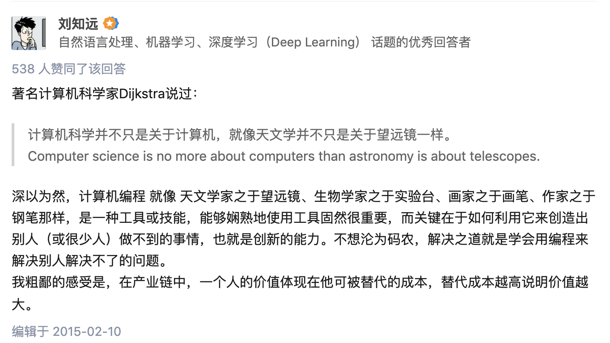
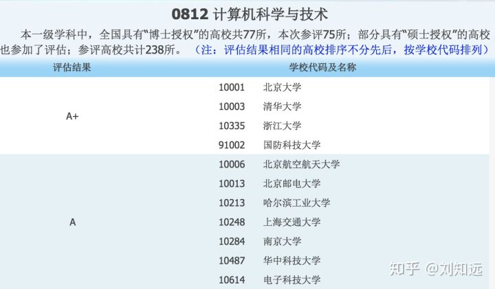
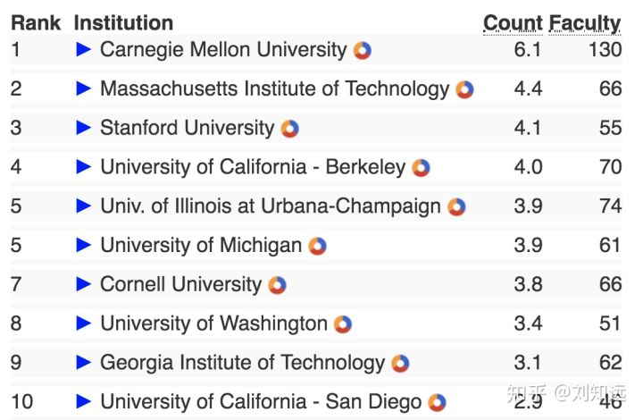
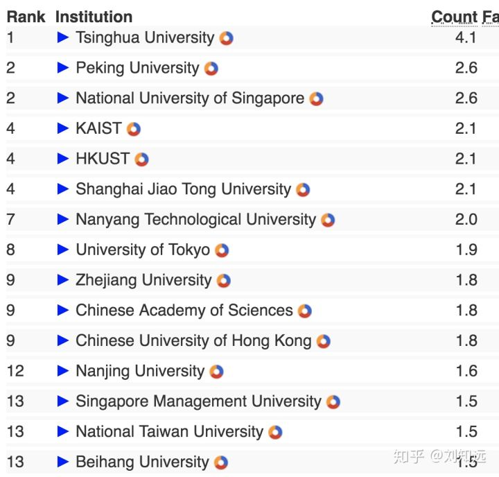
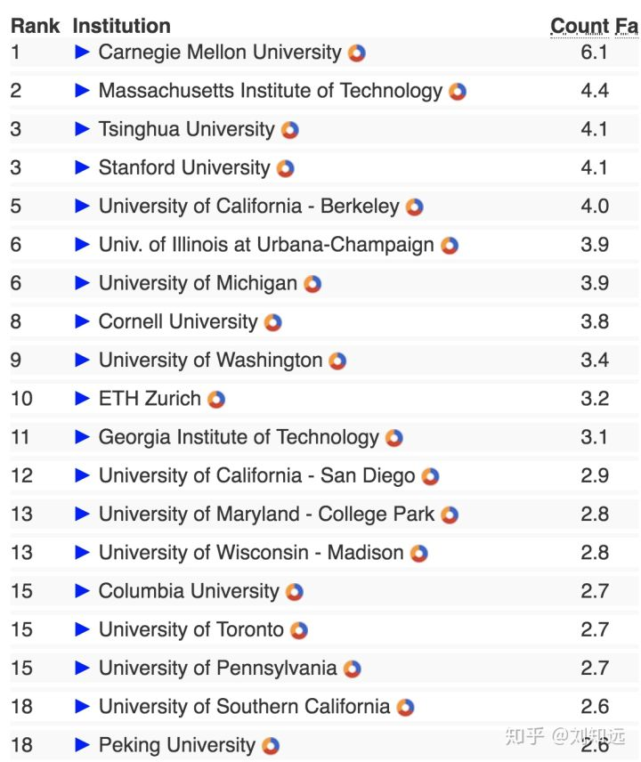

# 高考填报志愿如何选择计算机专业

2016年初AlphaGo战胜李世石，引燃了整个社会对计算机和人工智能的热情，这两年计算机专业的分数线节节攀升，今年无疑会更加火爆。我一直做学生工作，也参加过几次山东省招生工作，又常年混迹知乎，每到这时都会主动被动地做很多咨询，也会目睹很多抢人的戏码。今年高考马上就要出分了，所以我想，不如索性把考生和家长常见问题的答案都整理出来，希望更多优秀且真正喜欢CS/AI的考生能够选好学校和专业。这些回答仅代表我的个人观点。

如题所示，这篇文章的主要目标读者是正在填报志愿，并对CS/AI感兴趣的考生（及智囊团，如家长亲友等）。考生在阅读下面问题的回答前，建议先通过权威在线百科（如维基百科等）和在线社区（如知乎等），了解计算机科学与技术、人工智能的基本概念、主要方向、发展历史和前景。

**小测试**：如果你心目中计算机专业是教学生如何操作计算机、如何使用各类软件的话，请完成上段中的建议；如果你心目中计算机专业只是教学生编程的话，可以参考我的回答：

## Q：什么样的同学适合学计算机专业？

A：我从2006年开始做辅导员，2013年开始做老师，接触过十几届学生。单在我实验室，不仅有电子专业同学，更有过外语、医学专业的同学，同样做得非常出色。我最深刻的感受是，**兴趣是最重要的老师，它会引导着你主动发展自己提升自己**。在你认真了解各专业的基本概念和主要方向之后，如果发自内心的对计算机/人工智能在从事的事业感兴趣，那就可以尝试选择计算机专业。如果还不确定自己的兴趣，那就再去更深入地了解这些专业。在此基础上，数理思维强的同学加分，有编程经验的同学加分，但再说一遍，这些都是锦上添花，最重要的是发自内心的兴趣。这是我过去回答中经常提到的观点：[刘知远：为什么高考填志愿的时候，计算机专业远不如电子工程类专业热门？](https://www.zhihu.com/question/37364551/answer/75364711)

这几年计算机和人工智能发展和就业前景当然很好，也导致了计算机专业火爆。我是2002年上的大学，那时候计算机因为互联网泡沫破灭变得没那么热门，经管学院也还没什么竞争力，最热的是生物、电子和建筑。而过了16年的今天，经管方向已经火了好多年，计算机又重新火起来。所以，专业热度是随着社会发展而波动的，十年时间可能就会有天翻地覆的变化。即使计算机这样的朝阳学科，也可能会在发展中出现低谷（如2000年左右的互联网泡沫破灭）。如果仅凭当下是否好就业、好赚钱来决定专业取向，是非常不明智的做法。

## Q：为什么报计算机专业？

A：我之前曾做过一个回答：[刘知远：计算机博士与硕士比有什么劣势，如何拿到有竞争力的薪酬？](https://www.zhihu.com/question/25415505/answer/238630560) 里面对计算机专业的特点做了介绍：计算机学科建立时间很短尚不足百年，很多领域日新月异，并且正对人类社产生如此广泛深入的影响。计算机科技公司往往处在变革前沿，需要应对实际场景中不断涌现的新任务、新问题和新需求，是教科书甚至已有文献中没有现成答案的。计算机科技公司不仅需要熟练掌握已有知识和技术的人才，更需要能够独立探索和解决开放问题的高层次人才。

计算机专业呈现两个特点：一是，随着信息技术和互联网的日益广泛而深入的应用，以及智能化需求旺盛，在可见的未来里，市场会持续保持对计算机高水平人才的巨大需求，当然这个过程是螺旋式上升的，在不同时期、不同领域可能会出现需求波动，具体会体现在招聘人数和薪资水平上。二是，计算机学科高水平培养目标是，本科重在培养计算思维与基础，硕士重在培养特定领域的知识与技能，博士重在培养特定前沿方向的专家，不仅要对该前沿方向有全景式的认知，更需要掌握**独立解决前沿问题的能力**。因此，计算机学科很多方向博士的择业范围并不局限在科研院所，甚至大部分都会去各大计算机科技公司的前沿技术部门。

我私下里总觉得，计算机专业可算是**平民专业**，它不需要你家庭有背景有资源有人脉，不需要你能说会道。能不能行，全靠自己。只要你肯下苦功夫，练就真本事，市场就买你的账，企业就愿意出高薪聘任你。正因为大学里学习计算机专业要下真功夫，没有花架子，有背景的子弟也较少选这个专业。可以说，这种专业可以说是平民家庭实现阶层跃迁的最佳通道。

所以，从计算机的发展远景和专业特点来看，特别建议那些希望通过自身努力实现人生目标和价值的考生报考。

## Q：应该选计算机还是人工智能专业？

A：如前所说，计算机是一个高速发展的学科，仅有不到百年的发展历史，学科体系还远没有完善。计算机和AI专业培养目标应当是授人以渔，让同学掌握在计算机学科遨游的能力，而不止是具体的知识的技艺，因为后者中的大部分会很快过时。

人工智能旨在研究的是如何让计算机具备人类智能，如视觉、语言、动作、规划、推理等能力。人工智能的学科体系更远未完善，实现人工智能的路径与方案还处于探索之中。人工智能技术与计算机其他方向如体系结构、计算机网络等有千丝万缕的密切联系。因此，如同云计算、大数据、物联网一样，我更愿意把人工智能作为计算机的重要方向。

这两年由于人工智能在世界范围内都变得非常火，国内外最近开始成立人工智能学院和本科生项目，估计很多考生也跃跃欲试。这里的建议是，在报考本科专业时，可以不必纠结专业是计算机还是人工智能，还是要整体考察该校在计算机和人工智能方向的整体实力，因为这两者密切相关。也就是说，如果该校计算机方向偏弱，即使设有AI专业，其水平也不会太高；反之，如果该校计算机方向很强，即使不专门设置AI专业，其AI培养水平一般也不会太弱。

回到清华大学，清华计算机专业一直坚持“宽口径，厚基础”的培养理念（可参考清华招生网 [计算机类](http://join-tsinghua.edu.cn/publish/bzw2019/12240/2019/20190516023220283581130/20190516023220283581130_.html) 的介绍）。因此，虽然在国家层面计算机相关专业就有三个（计算机科学与技术、软件工程、网络空间安全），但清华坚持不专门开设小类本科专业（诸如大数据、网络安全、人工智能等），反而联合计算机系、交叉信息研究院和软件学院的力量，形成“计算机大类”招生。不蹭热度，一切为了培养学生更加宽广深厚的学科能力，这是我们的目标。希望考生能够认识到这点的重要性。

## Q：计算机/人工智能专业清华北大哪个好？

A：每当这时候，免不了两校扭打。所以我也来回答一下这个敏感的问题。希望北大相熟的朋友不要见怪，我并不是针对你们 :) 。因为今年初新一轮教育部学科评估清华和北大的计算机专业都被评为最高档A+，而且北大也新开设了图灵班，因此，北大今年估计会把计算机专业当做他们主打的王牌。这里对一些常见招生问题提供一些数据，仅供参考。

首先，清华北大的计算机哪个更好？今年第4轮教育部学科评估（[全国第四轮学科评估结果公布](https://link.zhihu.com/?target=http%3A//www.cdgdc.edu.cn/xwyyjsjyxx/xkpgjg/) 如下）只有分档而没有具体排名（需要注意，可能有招生老师会忽悠你这个名单中北大比清华排名高，实际上只是因为北大学校编码比清华编码小而已，清华、北大、浙大、国防科大四校都是A+，没有排名区分）。

而很多世界大学排名如QS、US News（把清华计算机排了世界第一）、ARWU都包含大量主观评分成分，我更推荐通过CSRankings了解各高校的CS学科水平：[http://csrankings.org/](http://csrankings.org/)

如我之前回答 [刘知远：如何判断美国教授们的科研水平？](https://www.zhihu.com/question/57311808/answer/327560178) 的介绍，CSRankings采用DBLP中各大学CS教授的顶会发表论文数量进行排名的，有确切数据支持，非常客观。如美国四大CS的Stanford、MIT、UCB和CMU就排在美国前四位（如下）。

根据亚洲排名，可以看到国内CS四大分别是清华、北大、上交、浙大。这个排名由于其客观性，得到了非常多CS世界顶级高校（如UCB，CMU，Cornell，爱丁堡，密歇根等）的报道。

把中国高校放到世界范围来看情况如下。

关于学科排名多说几句，因为没有公认的评价标准，也就没有完美的学科排名，我们需要辩证地参考和使用现有各种学科排名信息。即使CSRankings相对客观，由于没有考虑学术论文影响力因素（并不简单是引用量问题），也存在一定失真。例如，清华计算机整体实力和影响力与美国四大CS高校相比还有明显差距；然而同时也要看到，国内高校CS学科近年来发展速度不容小觑（从CSRankings按年度排序变化可以看出）。

其次，北大图灵班怎么样？这是北大重点宣传的项目，从材料看非常类似于清华姚班。相信该班成立对于我国CS高水平人才的培养会发挥重要作用。据我了解，与姚期智先生全职清华工作不同，John Hopcroft教授并非全职，可能他花在上海交大的时间还更多一些。关于该班在知乎上曾有讨论：[如何看待北京大学信息科学与技术学院开设“图灵班”？](https://www.zhihu.com/question/61463600)

最后，想专门对在清华北大之间纠结的考生提个建议。很多招生老师为了说服你什么话都能说，建议兼听则明，多咨询一些没有利害关系的专业老师和学长，多了解一些客观数据和资料，不要听信自由民主之类虚无缥缈的蛊惑。另外，可以准备几个你明确知道答案的问题拿来咨询联系你的招生老师，基本可以判断Ta是否满嘴跑火车。

## Q：女生适合读计算机专业吗？

A：适合。这一点，可以参考美国计算机专业规模第一大高校卡内基梅隆大学（CMU），其2016年报道本科生新生的女生比例已经达到48.5% （ [CMU’s Proportion of Undergraduate Women in Computer Science and Engineering Soars Above National Averages - News - Carnegie Mellon University](https://www.cmu.edu/news/stories/archives/2016/september/undergrad-women-engineering-computer-science.html)）。当下，计算机专业的女生较少有多方面的原因，既有社会大众对计算机行业的刻板印象和污名化（码农之类），也有计算机从业人士喜欢自我调侃，更有社会对女性就业的偏见。而实际上，在计算机各行业都活跃着女生的身影，例如我系毕业生连续三次获得国际顶级会议SIGMOD的十年最佳论文奖，都是女生（[清华女生再获ACM SIGMOD十年最佳论文奖（代发） (转载)](http://m.newsmth.net/article/DCST.THU/single/249/3)），等等。如前所说，计算机行业就靠真本事，背景性别都不是事儿，you can you up，而且不需要体力劳动，其实非常适合女生。

讲个小故事，我2014年在山东招生时，有位非常优秀的女生对计算机感兴趣，经过深入交流，很开心地招她到了计算机系，但在临近填报志愿时，她突然告诉我不想来清华计算机了，我马上跟她沟通，原来是友校老师向她极力渲染了计算机专业的恐怖学业和繁重工作，建议女生还是更适合外语专业，把她忽悠到了外语学院。最后，花了好长时间摆数据讲道理，才让她摆脱了对计算机的恐惧。现在四年过去了，她成功完成了本科学业，马上开始在我们系继续读研。这位同学就是[李晓涵](https://www.zhihu.com/people/8666c8ca8b23f1e1f08804eb9af045d5)，之前她的回答曾经提及过这段经历：[知乎用户：如何看待北大信息科学技术学院VS清华信息科学技术学院对比表格？](https://www.zhihu.com/question/47917808/answer/108253889) 我想说的是，社会上对女性的歧视无处不在，我们应当坚决抵制这种有意无意的倾向。

晓涵也介绍过在清华求学的经历：[知乎用户：作为一个清华 IT 女是怎么样的感觉？](https://www.zhihu.com/question/28339554/answer/40710956) 仅供参考。值得提醒的是，选择清华北大，选择要有所成就，就不要想太轻松，这点道理无论对男生女生都一样。希望更多具有独立自强精神的、对计算机感兴趣的女生勇敢地做出你的选择。

以上是我能想到的问题和回答，仅供参考，欢迎建议。希望能帮上那些对计算机/人工智能感兴趣的考生。衷心祝愿大家都能择其所爱，爱其所择，自强不息，实现梦想。