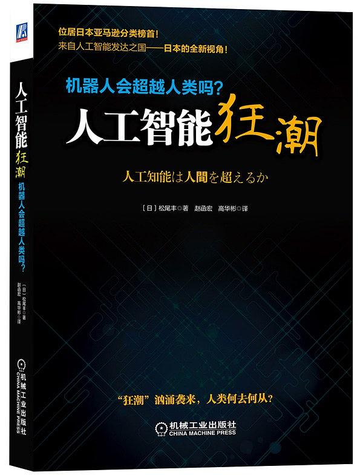
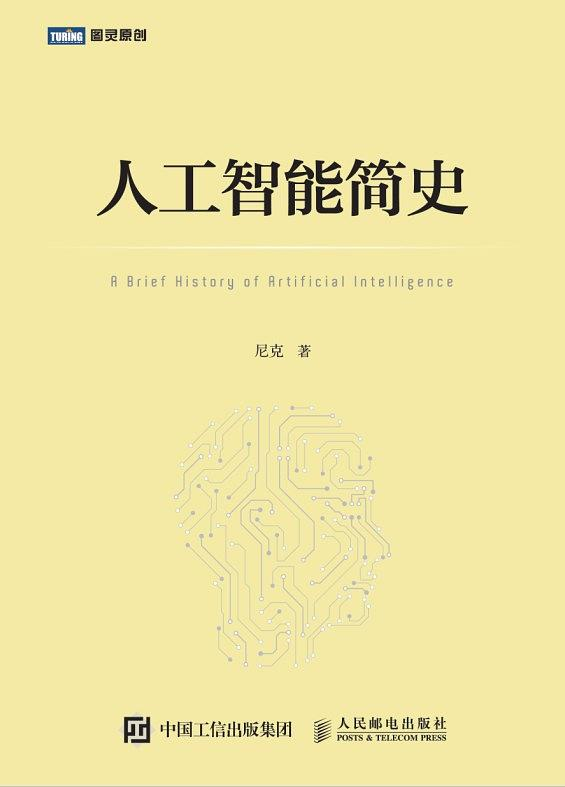
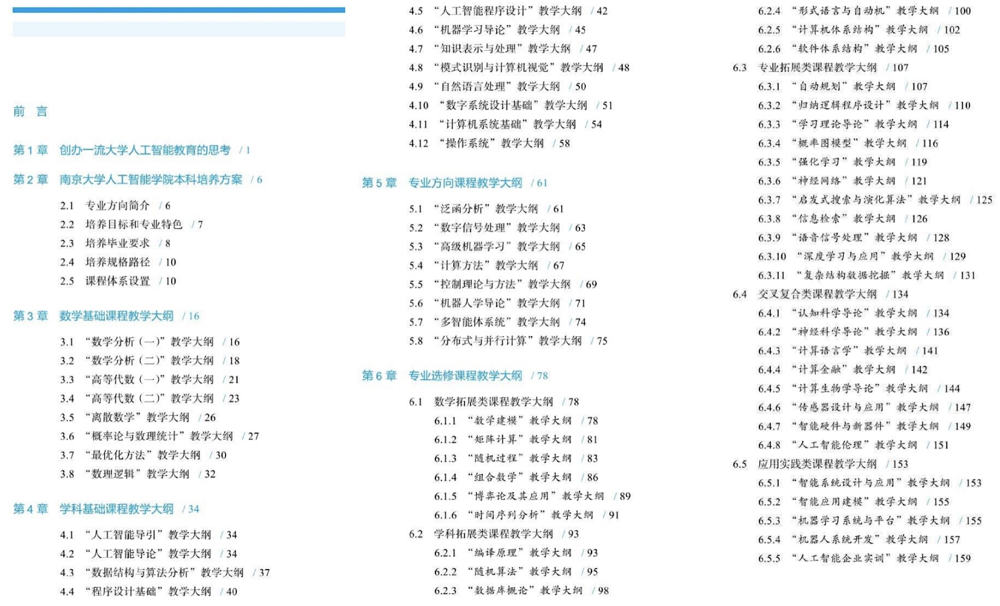
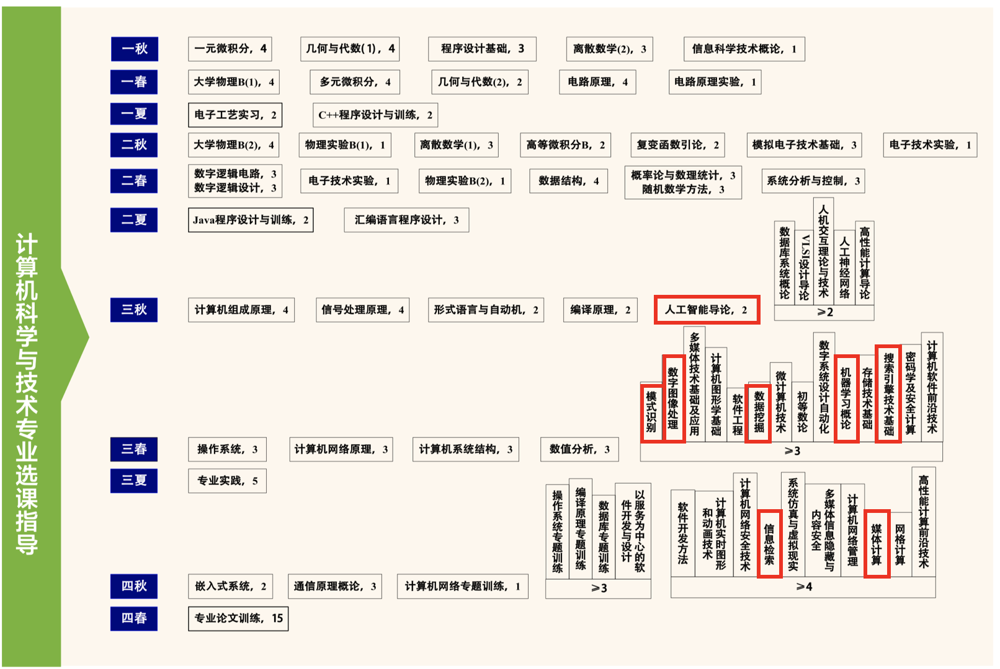
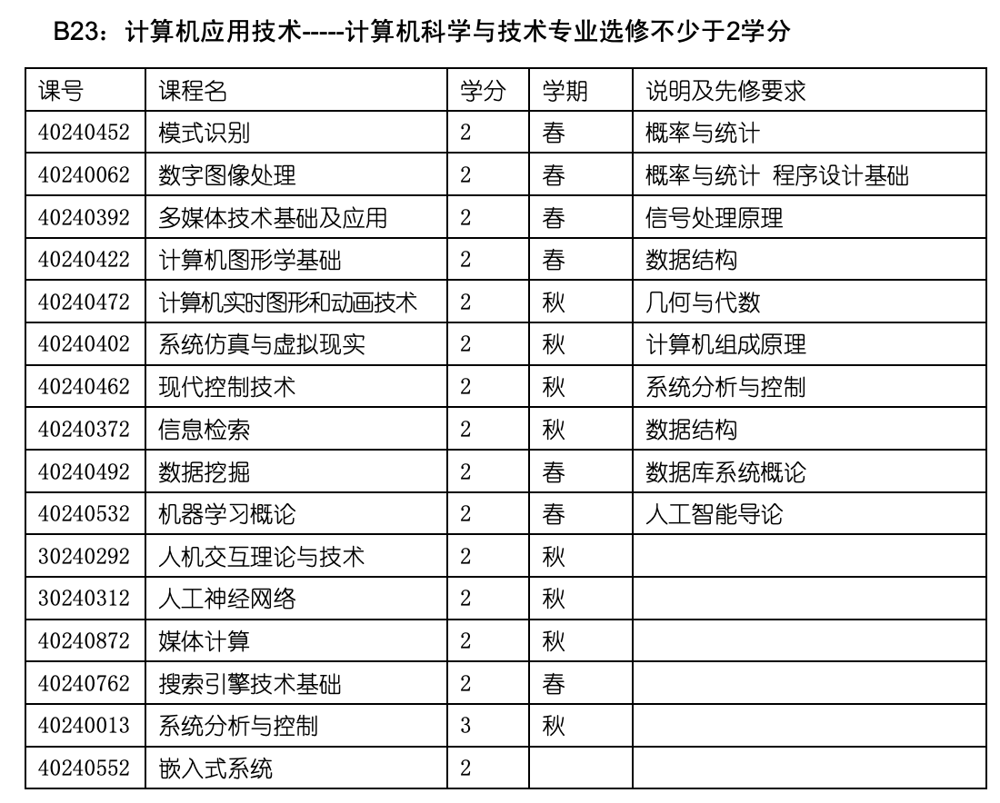
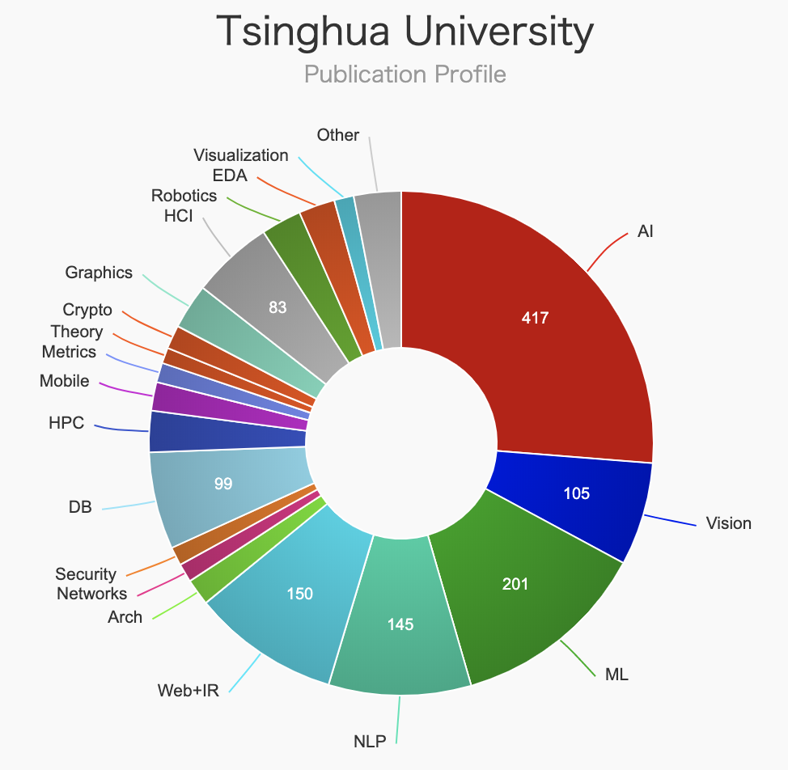
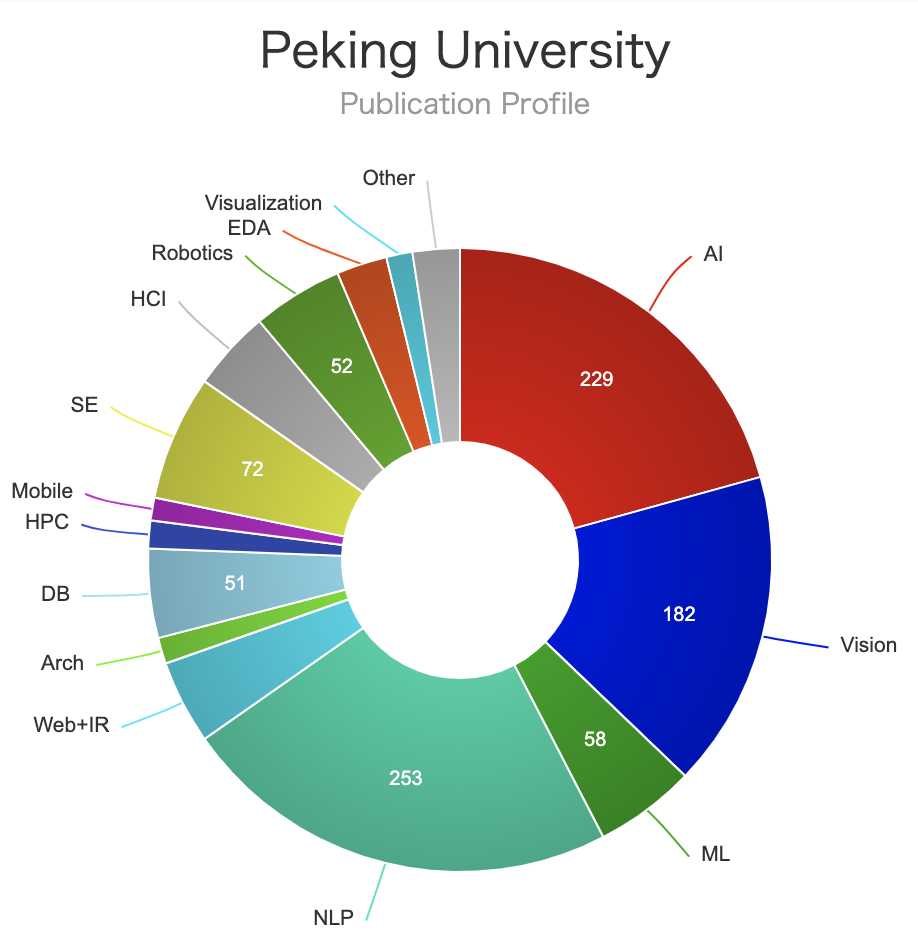

# 人工智能应该学什么、怎么学、以及去哪学

2018年6月高考结束后，我写过一篇短文：[写给正在填报志愿并对CS/AI感兴趣的考生们](https://zhuanlan.zhihu.com/p/38389147)，为的是在计算机专业日益火爆的当下，解答考生和家长们普遍好奇的问题，帮助考生更加理性地选择专业，希望更多真正喜欢CS/AI的考生选好学校选对专业。现在看，这篇短文除了部分统计数据有些过时外，提及的观点基本没有变化。而这一年里，国内CS/AI方向又有很多新的变化，最明显的是各大高校纷纷设立人工智能学院，开始招收人工智能专业本科生。所以最近花了些时间整理出这篇短文，讲讲人工智能应该学什么，怎么学，以及去哪儿学的问题。

## Q：人工智能是什么？

A：人工智能（Artificial Intelligence，AI）是一门年轻的学科，从1956年达特茅斯会议正式提出AI名称至今不过65年；从阿兰图灵1950年提出判断机器是否能够思考的图灵测试至今也不过70年时间。AI的70年发展史汇集了来自数学、计算机科学、逻辑学、哲学、神经科学、语言学等不同领域学者的努力，是典型的交叉学科。同时，从整体来看AI仍然是计算机科学技术的主要分支。

人工智能是什么？简言之，人工智能学科是利用计算机实现人类智能。人类智能并没有公认的定义与界限，实际上也随着AI的发展而有所变化。某项人类技能被计算机所掌握后，人们往往不再认为它代表人类"真正"的智能。例如，1997年IBM深蓝战胜人类国际象棋冠军卡斯帕罗夫后，就有评论说IBM计算机只是在暴力搜索，不是真正的智能，that's not thinking！这种现象又被称为"[AI Effect](https://en.wikipedia.org/wiki/AI_effect)"。

所以，人工智能总是聚焦在那些尚未被计算机破解的人类智能能力上。比较简单的人类智能已经被解决了，例如计数能力有了计算器，数据记忆和查询有了数据库，下棋能力有了下棋软件，剩下的是那些困难的高级智能。简单而言，如果我们把大脑看做一个黑盒，它能够接受外部世界的刺激信号，大脑处理这些信号产生输出反馈，人类智能正体现在这些"刺激-反馈"的对应中。针对不同刺激信号和反馈处理的复杂性，AI下面有很多专门的领域开展相关研究和探索。目前，公认的AI核心课题包括：机器学习、计算机视觉、自然语言处理、语音处理、知识表示与计算、推理与规划，等等，并在此基础上支持着许多重要应用场景如无人驾驶（无人车）、机器人等。

- 机器学习：旨在让计算机具备自动学习的能力，能够解决分类、聚类、回归、关联分析等任务。目前主流是从大规模数据中自动学习和总结规律，从而能够对新的数据进行预测，也被称为统计机器学习。简单地讲，机器学习是从大量"刺激-反馈"数据中自动总结规律的技术。
- 计算机视觉：旨在让计算机理解和处理图像数据（包括图片、视频等），使计算机掌握"看"的能力。图像是典型的无结构数据，由像素组成，如何从一幅图像中自动识别不同层次的对象（如轮廓、人脸、场景等）及其复杂关联，是计算机视觉面临的挑战问题。
- 语音处理：旨在让计算机理解、处理和生成人类语音，使计算机掌握"听"和“说”的能力。语音也是一种典型的无结构序列数据，看似简单的一维语音信号包含着丰富的信息如内容、意图、身份、情感、信道、场景、干扰等。以语音识别为例，目前在深度学习技术的支持下，普通场景的语音转文本的效果已经得到广泛应用。而在多人、方言、强噪、远场等挑战场景下，语音识别效果还需要进一步提升。
- 自然语言处理：旨在让计算机理解和处理人类语言。与C++、Java等人工设计的编程语言不同，人类语言是大自然的产物，因此被称为"自然语言"。人类语言也是典型的无结构数据，由字词组合而成，如何理解一句话、一篇文章甚至一本书的意思，也是人工智能面临的挑战问题。由于语言是人类特有的传递丰富信息和知识、表达复杂思想和情绪的载体，甚至被认为是人类思考的重要工具，因此自然语言处理问题更接近人类高级认知智能，有很多重要的开放问题。
- 知识表示与计算：人类对世界的认识积累形成了知识，知识是人类理解外部信息、实现各种智能能力的基础。近年来随着知识图谱的广泛应用，成为研究界和工业界关注的重点问题。

由于上述这些课题都关涉人类智能，所以互相密切关联、不分彼此，例如计算机视觉、语音识别和自然语言处理都是机器学习算法的重要应用场景，知识表示与计算也成为计算机视觉和自然语言处理方向的重要话题，等等。正因为年轻，这些方向都充满着活力，一方面最新技术日益深远地影响着人类社会生活的方方面面，同时学科体系和技术框架也在飞速地日新月异、推陈出新，现在去翻十年前的教材很多内容都显得过时了。

从学科设置来看，国内大学遵照教育部《学位授予和人才培养学科目录》来颁发学位。最初的计算机一级学科是"计算机科学与技术"，下设"计算机系统结构"、"计算机软件与理论"、"计算机应用技术"三个二级学科，其中"计算机系统结构"对应高性能计算（超算）和计算机网络体系架构（互联网），后来单独成立出"网络空间安全"一级学科；"计算机软件与理论"对应软件工程和计算机理论科学等，后来单独成立出"软件工程"一级学科；而"计算机应用技术"则对应计算机的各类应用技术，很大程度上正沿着从信息化到自动化再到智能化的路线前进，可以想见，如果现在这波AI浪潮还能持续几年，单独成立"人工智能"一级学科也指日可待。

从研究配置来看，AI研究队伍主要分布在计算机、自动化、电子工程等信息科学相关院系中，这与AI起源有密切关系，计算机的奠基人图灵、冯诺依曼，自动化的主要理论基础"控制论"的奠基人维纳，以及电子工程和信号处理的主要组成"信息论"的奠基人香农，均为AI的创立贡献了思想。所以，计算机系主要从计算理论和计算机应用的角度研究AI，自动化系从自动控制的角度理解AI，电子工程系则从信号处理（将AI关心的视觉、文本、听觉等模态理解问题看做信号处理）的角度解读AI。

当然，在哲学、脑神经等其他领域也有从事人工智能探索的学者。不过总体而言，由于人工智能核心目标是探索如何将人类智能转化为可计算问题，因此它主要还是落在计算机领域。

如果希望对AI发展有比较通俗全面的了解，可以参考以下两本书：《人工智能狂潮》虽然标题名略显中2，内容比较扎实，浅显全面并及时涵盖到最近的深度学习浪潮；《人工智能简史》是华人尼克的大作，作者搜集的史料全面扎实，夹叙夹议有很多干货，读起来很过瘾，不过很多地方点到即止，如果没有相关背景知识很难看懂作者所指。

## Q:人工智能学什么？

A：如前所述，人工智能大致还是一个计算机应用的课题。虽然这两年国内外已有很多高校开设了人工智能班和专业，课程设置还没有形成共识。我们可以从国内AI本科教育体系的先声——南京大学人工智能学院发布的《南京大学人工智能本科专业教育培养体系》做一些分析。

作为对比，这里列出清华大学计算机科学与技术系的选课指导清单，其中用红框标出了与人工智能有关的限选课程。

可以看到，人工智能需要学习的主要内容包括：

1. **数学基础课**：清华CS和南大AI都需要学习的有 微积分（或数学分析）、代数与几何、离散数学（或数理逻辑、图论等）、概率论。南大AI新增 最优化方法，这在清华CS为研究生课程。
2. **学科基础课**：清华CS和南大AI都需要学习的有 程序设计基础、数据结构、人工智能导论、计算机原理、数字电路、系统控制。南大AI新增 机器学习、知识表示、计算机视觉、自然语言处理 作为学科基础课，这在清华CS均为高年级选修课或研究生课程；清华CS需要额外学习 电路原理、信号处理、操作系统、编译原理、形式语言与自动机，这些被南大AI列为专业选修课。
3. **专业选修课**：南大AI设立了很多AI相关的专业选修课，如 自动规划、概率图模型、强化学习、神经网络、深度学习等，在清华CS均为人工智能方向研究生课程；而南大AI设立的很多认知科学、神经科学、计算金融、计算生物学、计算语言学等交叉课程，在清华则分散在各院系开设的课程。

由此可以总结，目前看AI本科专业核心课程的设置与计算机专业相比，重叠部分要远大于差异部分。可以看出南大在AI课程体系构建方面花费了大量心力，非常符合AI的当前发展特点。

所以，回到这个问题，人工智能学什么？建议就是以计算机核心课程（数学基础课、学科基础课）为学科主线，以 机器学习、知识表示、计算机视觉、自然语言处理 为学科特色，以学科交叉为辅助。因此，我们也可以说，无论是在以南京大学人工智能学院为代表的新成立的人工智能专业，还是以清华大学计算机系为代表的计算机专业，都可以完成对人工智能基础知识的学习。不同之处在于，前者预置为学科基础课，后者则成为高年级时的可选方向（计算机系统结构、计算机软件与理论、计算机应用技术）之一的计算机应用技术，如下是该方向的专业限选课程列表，其中超过一半课程是AI相关。

如果对这些课程要学什么感兴趣，可以购买查阅《南京大学人工智能本科专业教育培养体系》或者使用搜索引擎检索相关介绍。

## Q：人工智能怎么学？

A：清华大学章程明确提出"价值塑造、能力培养、知识传授"三位一体的育人模式，我认为这是高水平AI人才养成方式的最佳描述。

**知识传授**这层不必多说，师者传道受业解惑，在大学里通过课程讲授和课下实践，研习精通计算机和人工智能理论与技术，每位同学通过一门门课程成绩反映出的，正是专业知识掌握的水平。我想，绝大部分同学都能明白课程学习的重要性。然而，大学之道不仅于此，不然大学就不过是个专业技校。

在知识传授之上就要构筑**能力培养**，这对CS/AI专业而言尤其重要。计算机和人工智能是非常年轻的学科，正处在飞速发展的朝阳时期，学科知识更新换代很快，大部分最新知识根本无法在短时间内及时沉淀到教科书中。而进入教科书的那些知识，与实际应用场景往往已有较大距离。很多CS/AI高科技公司自身就站在学科最前沿，亟需有快速学习和独立解决开放问题能力的人才。这样，一方面要求同学有意识建立终身学习的理念，有较强的独立学习的能力；另一方面则要求同学注意通过实验室研究等方式锻炼科研创新能力。CS/AI同学们需要主动参与科研工作的全过程，树立专业志趣，培养独立学习的能力、自我学习的习惯、提出问题的意识、以及独立解决开放问题的能力，这是大学培养CS/AI高水平人才的必由之路。因此，大学教师在CS/AI开展高水平原创研究的能力，也一定程度上决定了他们对学生进行能力培养的水平。

最后一层**价值塑造**也许是最玄乎的，但更加重要。一个人在知识和能力确定的情况下，Ta的努力方向和坚持程度最终决定其成长的高度。找到在术业上的坚持方向，就是价值塑造的过程。这个过程绝不是简单粗暴的灌输和宣讲就能实现的，要有高水平的教师一起教学相长，有志存高远的同学共同努力拼搏，有各界奋斗的学长作为示范榜样，有校外海外的实践平台广开视野。实践出真知，只有自己多听多看多想，才能找到自己喜欢的、努力的方向，也才更有后劲坚持不懈。

所以，不管是人工智能、计算机专业还是其他什么专业，只要想把自己培养成为该领域的可堪大用之才，就需要从知识、能力和价值这三个层面来努力提升自己。

## Q：人工智能去哪学？

A：上面说了这么多，接下来图穷匕见，再聊聊在国内人工智能应该去哪里学。根据前面几个问题的回答，可以从师资水平、课程设置等方面来做判断，其中师资水平应该是最重要的因素，而课程设置、培养水平等与师资水平直接正相关。

如何判定AI师资水平，与QS、THE、US News、ARWU等大学或学科排名相比，我更推荐UMass教授Emery Berger维护的高校计算机科学领域排名[CSRankings](http://csrankings.org/)，采用DBLP数据库中大学CS/AI教授在不同方向顶级会议上发表的论文数量进行排名，有客观确切数据支持，例如美国号称CS四大名校的Stanford、MIT、UCB和CMU就排在美国前四位。同时CSRankings工程和数据全部开源在github上，可以非常方便地进行检查、复现和扩展。

CSRankings将CS划分为AI、Systems、Theory、Interdisciplinary Areas四个一级方向，每个方向有有若干子领域，例如AI就又下分General AI （AI总方向）、Computer Vision (计算机视觉)、Machine Learning & Data Mining（机器学习与数据挖掘）、Natural Language Processing（自然语言处理）、The Web & Information Retrieval（互联网与信息检索）。每个字领域只收录2-3个顶级会议，这主要是因为计算机科学技术由于发展比较快，所以学者们更重视通过国际会议论文发表最新成果进行学术交流，而不像其他领域那样主要是通过期刊发表最新研究成果。

由于CSRankings原网站没有提供中国单列的高校排名，国内学术网站AMiner做了一个[改进版](http://csrankings.aminer.cn/)，除了提供中国高校单列名单外，还额外提供根据论文引用数量的排名。如果按照2009-2019十年间论文发表统计，我简单统计了国内AI/CS排名较高的高校（不含香港台湾高校、不考虑中科院）排序如下。同时表格还列出2016-2019近三年的排序数据，可以看到，最近几年国内高校AI进步神速，特别是清华AI已经跃居世界第一。

|   大学   | 2009-2019 AI大陆排名 | 2009-2019 AI世界排名 | 2016-2019 AI大陆排名 | 2016-2019 AI世界排名 | 2009-2019 CS大陆排名 | 2009-2019 CS世界排名 |
| :------: | :------------------: | :------------------: | :------------------: | :------------------: | :------------------: | :------------------: |
|   清华   |          1           |          2           |          1           |          1           |          1           |          10          |
|   北大   |          2           |          5           |          2           |          3           |          2           |          32          |
|   复旦   |          3           |          22          |          3           |          14          |          5           |          76          |
|   浙大   |          4           |          23          |          4           |          20          |          4           |          59          |
|  上交大  |          5           |          39          |          5           |          23          |          3           |          48          |
|   南大   |          6           |          49          |          7           |          52          |          6           |         105          |
|  哈工大  |          7           |          85          |          6           |          45          |          10          |         183          |
|   北航   |          8           |          94          |          9           |          84          |          7           |         131          |
| 电子科大 |          9           |          94          |          8           |          73          |          9           |         160          |
|  中科大  |          10          |         135          |          10          |         113          |          8           |         131          |

这个排序大致能够反映各大高校CS/AI专业的国际学术前沿整体水平，而且通过AI领域和CS整体的排名反差，可以观察到该高校AI方向的强势程度，例如复旦的AI排名高于其CS排名2位，哈工大AI排名高于CS排名3位等等，说明这两所大学的AI方向相对比较强势。而且，还可以看出，国内高校AI领域的世界排名明显超过CS整体的世界排名，说明国内高校在AI方面更接近世界前沿水平。

需要注意：（1）这个统计结果只能反映师资力量的一个侧面，而很多国内高校如北航、国防科大等在国家信息科学重大需求方面做出的巨大贡献如天河等，并无法客观反映到这个统计中。（2）由于CSRankings作者Emery Berger坚持只收录能招收博士的CS教授，因此那些在电子工程或自动华系等其他非CS系的教授没有被收录进来，从而导致该清单并不能完全反映各大高校的AI等领域的师资水平，但也正因为其只收录CS教授，也许对于我们评判这些高校的CS专业师资力量更有帮助。此外，部分高校可能面临教授列表不全等问题，**CSRankings接受修改申请，建议国内高校相关院系可以去申请更新**。

CSRankings主要以高校为单位进行排序，前几天我组同学用CSRankings开源数据，对AI领域的国内C9高校学者进行了排序，可以看到前20的学者有7位清华、5位北大、2位南大、2位浙大、2位哈工大、2位复旦，可以从另一个侧面反映各高校的AI师资力量。

总之，我认为CSRankings是很好地定量了解各高校CS各领域研究实力和师资力量的平台，例如下面就是CSRankings提供的清北两校不同领域发表论文分布的饼状图。

|                           |                           |
| ------------------------- | ------------------------- |
|  |  |

|         **领域**         | **2009-2019 清华世界排名** | **2016-2019 清华世界排名** | **2009-2019 北大世界排名** | **2016-2019 北大世界排名** |
| :----------------------: | :------------------------: | :------------------------: | :------------------------: | :------------------------: |
|   **所有领域（All）**    |           **10**           |           **6**            |           **32**           |           **22**           |
|    **人工智能（AI）**    |           **2**            |           **1**            |           **5**            |           **3**            |
| **系统结构（Systems）**  |           **18**           |           **10**           |           **36**           |           **33**           |
| **计算机理论（Theory）** |           **35**           |           **39**           |           **-**            |           **-**            |
|  **交叉领域（Inter）**   |           **10**           |           **9**            |           **43**           |           **65**           |

如果觉得只考虑顶会论文数量还不够，学术网站AMiner对CSRankings进行了扩展，考虑了论文引用数，http://csrankings.aminer.cn/，大家也可以参考。国内高校在顶会论文引用数（体现学术影响力）的世界排名普遍比论文数的排名要低，这点正是国内高校需要继续努力的方向。不过国内高校近年来在引用数排名上的进步速度也非常可观。

|         **领域**         | **2009-2019 清华世界引用排名** | **2016-2019 清华世界引用排名** | **2009-2019 北大世界引用排名** | **2016-2019 北大世界引用排名** |
| :----------------------: | :----------------------------: | :----------------------------: | :----------------------------: | :----------------------------: |
|   **所有领域（All）**    |             **12**             |             **7**              |             **39**             |             **38**             |
|    **人工智能（AI）**    |             **4**              |             **3**              |             **8**              |             **7**              |
| **系统结构（Systems）**  |             **18**             |             **9**              |             **38**             |             **42**             |
| **计算机理论（Theory）** |             **37**             |             **39**             |             **-**              |             **-**              |
|  **交叉领域（Inter）**   |             **11**             |             **4**              |             **27**             |             **58**             |

## Q：想来清华学人工智能去哪学？

A：通过上个问题可以看到，想在国内学习AI，高考分数够的话，清华大学是不二选择。如果想来清华学AI都有哪些选择呢？这里对清华与AI有关的[专业大类](http://www.join-tsinghua.edu.cn/publish/bzw2019/12173/index.html)做一个简单介绍：

- 计算机类：含交叉信息研究院的计算机科学实验班（姚班）、人工智能学堂班（智班）、计算机系、软件学院。如前所述，**AI核心目标是探索如何将人类智能转化为可计算问题，主体落在计算机领域**。所以清华计算机类是学习AI的首选。
- 自动化（与工业工程）类、电子信息类。如前所述，自动化的主要理论基础"控制论"的奠基人维纳，以及电子工程和信号处理的主要组成"信息论"的奠基人香农，均为AI的创立贡献了思想，所以自动化系从自动控制的角度理解AI，电子工程系从信号处理的角度解读AI，也与AI有密切关系。因此自动化类、电子信息类也是学习AI的可选方案。
- 数理类、文理通识类。数理类下的基础科学班以及文理通识类新雅书院，均支持同学自由选择未来发展方向。人工智能（特别是其中偏重基础理论的机器学习）是基科班同学的热门选择；而新雅书院也有大量同学选择计算机和人工智能方向。
- 其他工科类。清华是工科强校，在信息化和智能化的浪潮下，很多传统强势的工科方向近年来也开始努力开展智能化转型，如土木系的智能建造、电机系的智能电网，车辆学院的无人驾驶（成立了清华智能驾驶实验室）、精仪系的类脑器件（成立了清华类脑计算研究中心），可以说几乎每个工科大类都有深度参与智能化的研究方向。依托清华在信息技术上的优势，人工智能技术将为很多工科方向带来新的研究热点，共同造福人类社会。希望更多对AI感兴趣的同学来选择参与到这些交叉方向上来，让AI技术得到更快更广更深的应用。
- 文科类。清华的文科方向大多小而精，我由于从事一些交叉方向研究，所以与很多文科方向比较熟悉，例如社科学院有社科大数据的构建与研究，法学院致力于计算法学研究，中文系有计算语言学研究，外文系有语言认知研究，心理系有脑认知研究，美学院有信息交互设计和智能艺术创作研究，这些都与计算机和人工智能有密切联系，具有高度的文理交叉特点。所以，如果文科同学对人工智能感兴趣，也能在这些方向上充分感受清华的AI力量。

关于清华各院系和专业类的详细介绍，可以直接下载浏览《[清华大学2019年本科招生报考指南](http://www.join-tsinghua.edu.cn/publish/bzw2019/12156/20190617172028253709751/1560764793210.pdf)》，简单搜索“智能”、“无人”、“类脑”等关键词，就可以找到哪些专业和院系在从事与人工智能有关的研究。

以上是我能想到的问题和回答，仅供参考，欢迎建议。希望能帮上今年那些对CS/AI感兴趣的考生。衷心祝愿大家不畏浮云，理性判断，做好人生的重要选择。